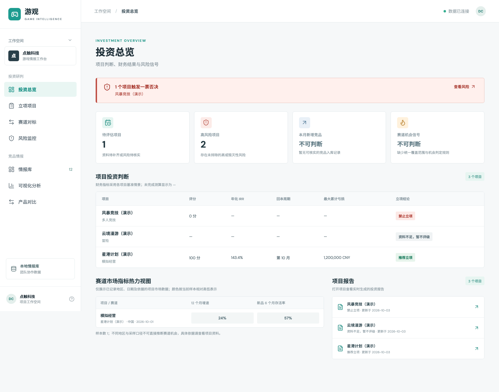
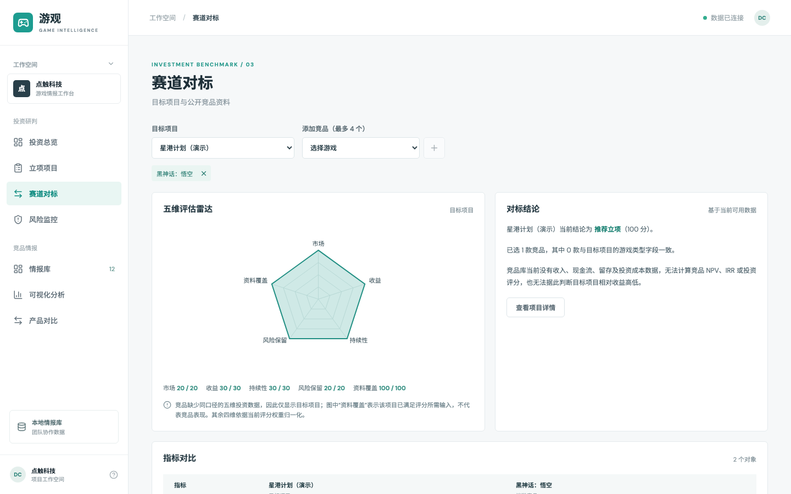
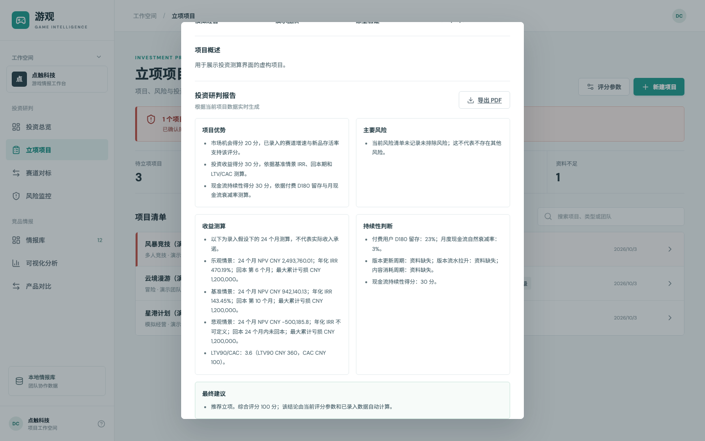
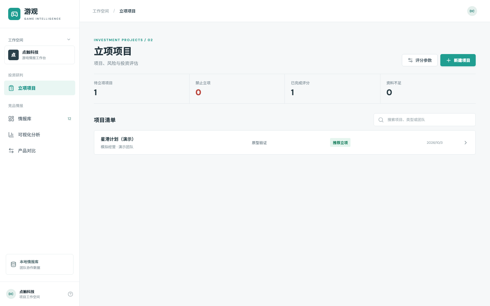
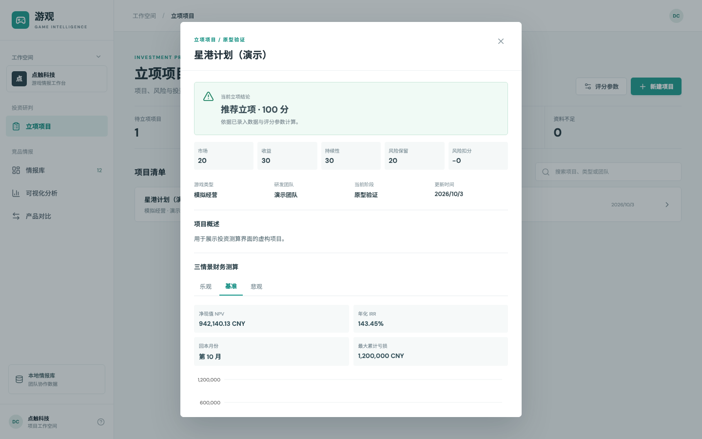
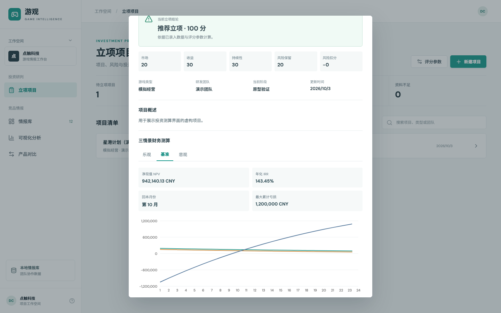

# 游观：游戏投资立项决策情报系统

面向游戏投资立项研判的内部工作台。已完成项目与风险库、三情景财务测算、自动评级、投资总览、赛道对标、风险监控和实时投资报告（含中文 PDF）。阶段④正在补齐可信数据导入、数据库与角色权限；正式组织联调与部署见[分阶段开发计划](docs/phase-plan.md)。

## 页面预览

> **给合作伙伴的查看备注（2026-10-03）：**这是阶段③验收版，已完成投资总览、项目详情四视图、赛道对标、风险监控和中文 PDF 报告。请先查看下方截图；需要实际操作时按“本地运行”启动。截图中的项目和财务数字均为演示假设，请重点反馈录入流程、评分口径及页面呈现。当前尚未提供可交互的公网地址。

以下截图使用虚构的演示项目，不含本机项目数据。合作伙伴可先查看界面效果，再按下方步骤在本地运行交互版。

**阶段③：投资决策工作台**







[查看风险监控截图](docs/screenshots/stage3-risk-center.png)

**阶段②：项目与财务测算**







## 本地运行

要求 Node.js 20+。

```bash
npm install
npm run dev
```

打开 `http://localhost:5173`。前端由 Vite 启动，API 位于 `http://127.0.0.1:3001`，健康检查为 `GET /api/health`。两个服务默认只监听本机。执行 `npm run build` 后可用 `npm start` 从同一服务提供前端与 API。测试命令为 `npm test`。

首次运行读取 `data/seed.json` 中的 12 款演示游戏；网页新增、编辑、删除后会保存到 `data/games.json`。后者已加入 `.gitignore`，不会把团队运行数据误提交到代码仓库。演示记录的价格、好评率、评价数和在线峰值只是界面样例，不应作为真实市场结论。

待立项项目与竞品游戏分开保存，项目资料保存在本机 `data/projects.json`，评分参数保存在 `data/score-config.json`。项目可录入市场、用户、商业化、运营指标，以及乐观、基准、悲观三情景的财务假设；系统计算 24 个月现金流、NPV、年化 IRR、回本月和最大亏损。已确认的毁灭性风险会自动触发“禁止立项”；资料不足时暂不评级。基准情景 NPV 不大于 0 或 24 个月内未回本时，分数封顶 49，结论为“不推荐立项”。项目分数和结论不可手动填写。具体口径见[阶段计划](docs/phase-plan.md)。

投资总览与风险监控使用已录入的项目和风险事实；赛道对标可选择最多四款竞品。竞品商品页指标不能代替财务数据，缺少同口径数据时显示“未取得”。项目详情中的报告由当前数据实时生成，可通过 `GET /api/projects/:id/report` 读取 JSON，或通过 `GET /api/projects/:id/report.pdf` 导出中文 PDF；报告不会保存为历史快照。PDF 使用仓库内的 Noto Sans SC 字体，其许可见 `assets/fonts/OFL.txt`。

## 公开情报样本与导入

可信快照可先执行 `node scripts/import-verified-snapshot.mjs --file <快照路径>` 预检，确认条数、来源与指标口径；使用 `--apply` 才写入情报库。格式与来源规则见[数据来源说明](docs/data-sources.md)。公开商品数据不能推算销量、收入或留存。

`data/imports/public-games-2026-10-03.json` 是 2026-10-03 采集的 49 款公开样本，覆盖 PC、iOS、Android、PS4、PS5、Xbox、Switch，附来源、抓取时间、指标口径和缺失值说明。网页“导入 JSON”可批量导入；相同 Steam App ID 的演示记录会更新为真实来源记录，重复导入会跳过已有记录。导入后的运行数据保存在本机 `data/games.json`。

`data/imports/立项分析-2026-10-03.md` 给出样本观察、局限与立项验证步骤。可用 `node scripts/collect-public-games.mjs` 重新采集；采集器校验完整性后按抓取时间生成新的 JSON 快照，失败时不发布，也不会覆盖已有快照。该样本不包含可验证的销量或收入，不应据此直接预测盈利。

大目录扩展见 `data/imports/目录扩展说明-2026-10-03.md`。当前本地运行库有 1,499 条：端游 806、App 557、微信小游戏 136。`node scripts/collect-game-catalog.mjs` 可从 Steam、Apple 美国区和腾讯应用宝微信小游戏目录重新生成带时间戳的快照；新目录记录主要是商品元数据，未取得的指标保持 `null`。网页可按三类筛选，并每页显示 50 条；批量导入支持单个 JSON 文件最多 2,000 条。

## 现有钉钉连接

详细步骤见 [钉钉游戏信息助手接入说明](docs/dingtalk-bot-setup.md)。

1. 在钉钉开放平台为**点触科技股份有限公司**创建企业内部应用，添加机器人能力，选择 **Stream 模式**，发布并让组织成员可用。
2. 将 `.env.example` 复制为 `.env`，填入应用的 `DINGTALK_CLIENT_ID`（AppKey）、`DINGTALK_CLIENT_SECRET`（AppSecret）。建议同时填写点触科技的 `DINGTALK_CORP_ID`。
3. 运行 `npm run dev` 或在构建后运行 `npm start`；服务启动时会自动读取 `.env`。
4. 在钉钉与机器人单聊，或将机器人加入组织内群聊，发送 `查询 星露谷`、`黑神话`、`游戏科学` 等文字。机器人检索与网页相同的情报库，并标记演示指标。

仓库已有机器人代码；钉钉连接及实际组织联调由卢雨负责。本阶段不修改机器人或实现新的钉钉登录。工作台只接收外部身份服务签署的用户与角色信息。

## 数据库与权限

默认仍使用本地 JSON。多人使用前可运行 `npm run migrate:sqlite -- --database <新数据库路径>`，核对数量后在 `.env` 设置 `DATABASE_FILE=<该路径>`。迁移保留原 JSON，不覆盖已有不同内容的 SQLite。使用 `npm run backup:sqlite -- --database <运行库> --output <新备份路径>` 创建一致性备份；用 `npm run restore:sqlite -- --backup <备份路径> --database <新目标路径>` 恢复。备份和恢复拒绝覆盖已有文件。切回 JSON 模式只需取消 `DATABASE_FILE`，但该模式不会读取 SQLite 期间的新改动。

本机默认 `AUTH_MODE=local`，仅允许监听 loopback，并创建本地管理员会话。团队环境须设置 `AUTH_MODE=external`、`AUTH_CORP_ID`、`AUTH_SHARED_SECRET`、`EXTERNAL_LOGIN_URL`、`AUTH_COOKIE_SECURE=true`，由现有身份服务在验证用户后调用 `POST /api/auth/exchange` 换取工作台会话。投资人只读；分析师可维护项目和游戏；管理员还可修改评分参数。写请求使用会话 CSRF 令牌。卢雨已负责钉钉连接，本仓库不再开发钉钉登录；身份交换的签名字段及回跳流程需与其现有服务联调。

具体字段见[外部身份对接契约](docs/auth-integration.md)。[部署说明](docs/deployment.md)包含单实例 Docker Compose、Caddy HTTPS、SQLite 持久卷和上线检查命令；真实组织账号与团队域名仍须在目标环境完成联调。

**部署注意：**默认只监听 `127.0.0.1`。正式开放团队访问前，需要用真实身份服务、HTTPS、持久化数据库和目标网络环境完成联调；本地预览地址不对外可访问。

## 模块协作

本轮按目录分工：数据采集负责 `scripts/` 与 `data/imports/`，后端负责存储和接口，Web 负责 `src/`。卢雨负责现有钉钉连接；协调集成负责共享接口约定和验收。

仓库默认分支为 `main`。接入团队可访问的 Git 远端后，各模块使用独立功能分支，合并前运行 `npm test` 和 `npm run build`，并由协调集成检查共享接口：

```bash
git switch -c feat/web-experience
git add .
git commit -m "feat: improve game intelligence features"
git push -u origin feat/web-experience
```

通过合并请求审查后合并到 `main`。仓库已配置 Git 远端 `origin`，提交和推送前请确认目标分支及远端权限。
